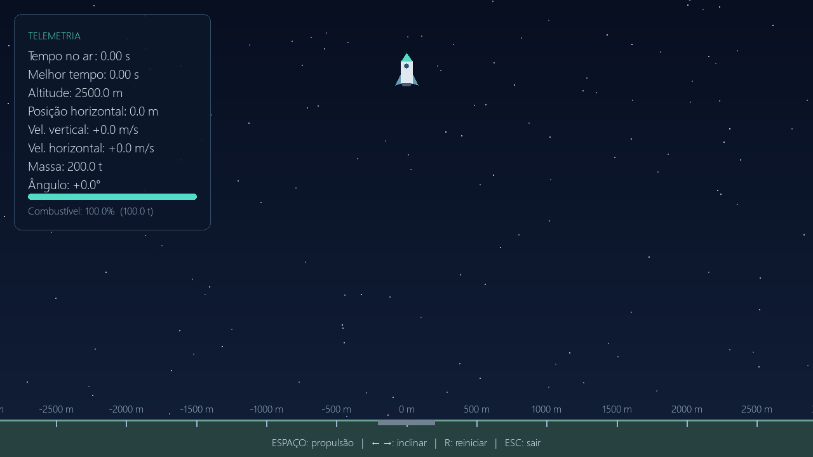

# Jogo de foguete — Trabalho de Física

Jogo desenvolvido em Python com pygame-ce para simular o movimento de um
foguete sob gravidade, com empuxo, inclinação e consumo de combustível.



## Como executar

### Executável para Windows

Para entregar ao professor, use `entrega-foguete.zip`. Extraia o ZIP e abra
`entrega/JogoDeFoguete.exe` com dois cliques. O executável é para Windows de
64 bits e já inclui Python e pygame; não é necessário instalar dependências.
A pasta `entrega/codigo-fonte` contém os arquivos do projeto e os testes.

Para gerar novamente o executável e o ZIP, execute no PowerShell, na pasta
do projeto:

```powershell
.\gerar-executavel.ps1
```

O script instala as dependências de compilação de `requirements-build.txt`
em `.venv-build`, executa os testes e usa PyInstaller para gerar
`dist/JogoDeFoguete.exe`. A compilação requer Python e acesso à internet.

### Código-fonte

Você precisa do Git e do Python. O projeto foi testado no Windows com
Python 3.14.7 e pygame-ce 2.5.8.

No PowerShell ou terminal do Windows:

```powershell
git clone https://github.com/lucas-vinicius-rds/trabalho-foguete.git
cd trabalho-foguete
py -m pip install -r requirements.txt
py main.py
```

O jogo abre em tela cheia. Em sistemas sem o launcher `py`, use o comando
do seu interpretador Python, como `python3`, nos comandos acima.

## Controles e objetivo

Segure **Espaço** para propulsionar e use **← / →** para inclinar o foguete.
**R** inicia uma nova tentativa e **Esc** sai. O objetivo é permanecer no ar
pelo maior tempo possível. O recorde é mantido durante a sessão.

## Arquivos do projeto

| Arquivo | Função |
| --- | --- |
| `main.py` | Loop do jogo, câmera, desenho, interface e score |
| `rocket.py` | Estado do foguete e integração do movimento |
| `physics.py` | Constantes físicas e passo de tempo |
| `test_game.py` | Testes da física, score e reinício |
| `requirements.txt` | Dependência necessária para executar |

A [tela de fim de voo](preview-game-over.png) exibe o tempo da tentativa
e o melhor tempo da sessão.

## Física para a apresentação

O foguete começa a 2500 m de altitude, em repouso, com 100 000 kg de massa
seca e 100 000 kg de combustível. As posições são medidas em metros e as
velocidades em metros por segundo. O eixo y aponta para cima.

Em cada frame de propulsão são consumidos 100 kg (0,1% do combustível inicial).
O empuxo é de 2 000 000 N na direção do nariz. Para o ângulo θ em relação à
vertical, as forças e acelerações são:

```text
m = massa seca + combustível no início do frame
Fx = empuxo × sen(θ)
Fy = empuxo × cos(θ) − m × 9,8
ax = Fx / m
ay = Fy / m
```

Sem propulsão ou sem combustível, o empuxo é zero. A gravidade permanece
em 9,8 m/s². Usamos Euler semi-implícito com Δt = 1/60 s:

```text
vx ← vx + ax × Δt       vy ← vy + ay × Δt
x  ← x  + vx × Δt       y  ← y  + vy × Δt
```

As setas definem um ângulo-alvo de −30° ou +30°. O giro é de 60°/s em torno
do centro de massa; soltar as setas faz o foguete retornar à vertical. É uma
simplificação de controle: não simulamos torque, momento de inércia, arrasto
ou variação da gravidade com altitude.

Ao atingir y ≤ 0, o foguete para e a tentativa termina. O score é a quantidade
de passos até a colisão multiplicada por Δt, com resolução de 1/60 s. O desenho
do foguete é ilustrativo: a colisão considera seu centro de massa.

A câmera acompanha o movimento horizontal e sobe em grandes altitudes.
Não existem paredes laterais. As marcas no solo indicam a posição horizontal.
A câmera e a animação da chama não alteram a física.

O loop executa um passo por frame e limita a renderização a 60 FPS. Se o
computador não atingir essa taxa, a simulação ficará mais lenta que o tempo
real; o score continua medindo tempo simulado.

## Verificação

```powershell
py -m unittest -v
```

Os testes conferem queda livre, colisão,
empuxo inicial, consumo até esgotar o combustível, limites de inclinação,
movimento horizontal, score e reinício.
